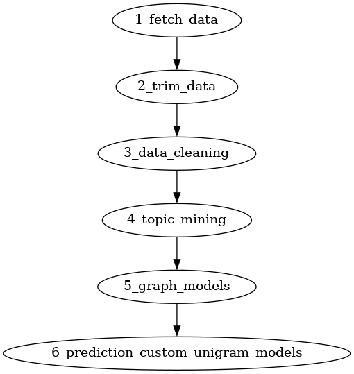

## Development

`docker build . -t cs410`

`docker run -v "${PWD}":/home/jovyan/work -p 8888:8888 cs410`

## Overview

This project contains the jupyter notebook server meta data
for us to create a genre prediction model.

The process is located in `notebooks` where stages of the process are numbered.

The process starts alphabetical so the first stage is `1_fetch_data`, and the final stage is `6_prediction_custom_unigram_models`.

## Primary Process

Even though there may be multiple files per stage, there is a single path between stages per result. We make it so that different techniques may be experimented with per stage.

Additional documentation is given in each stages file.